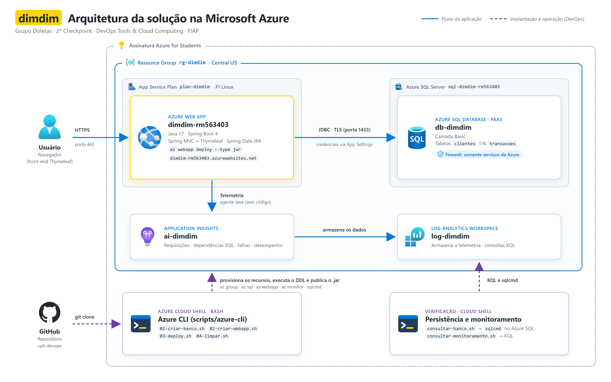
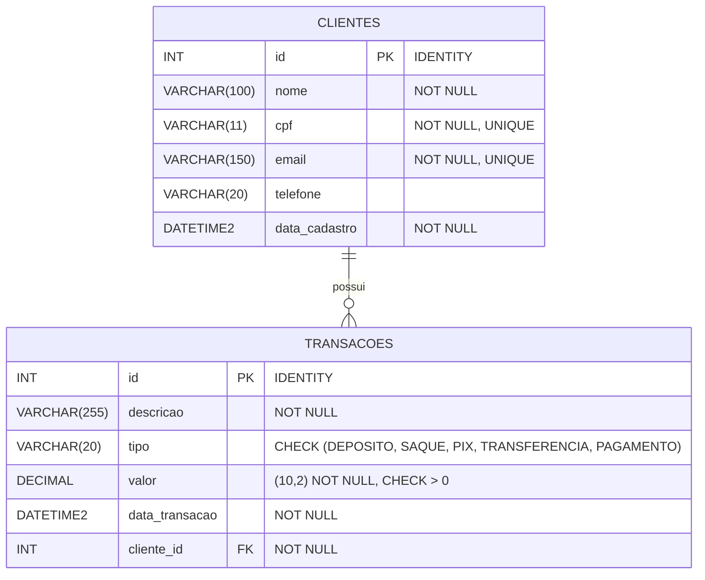
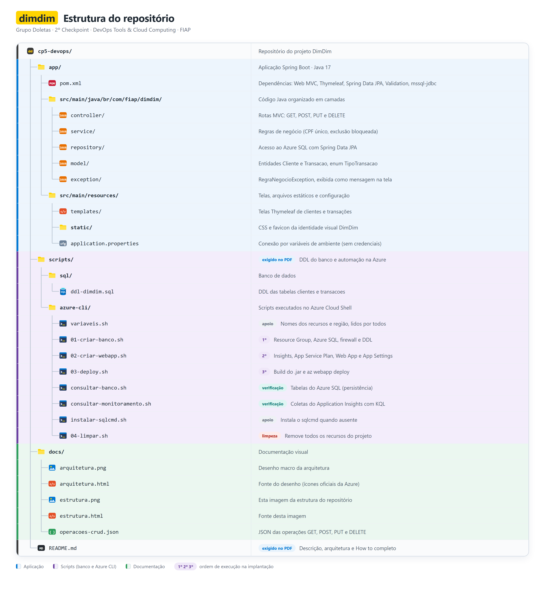

# DimDim · Web App com Azure SQL

Aplicação web do banco digital **DimDim** para gestão de **clientes** e **transações**, publicada em um **Azure Web App**, com persistência no **Azure SQL Database** (PaaS) e monitoramento pelo **Application Insights**. Toda a infraestrutura é criada e o deploy é feito de forma automatizada com **Azure CLI** e `az webapp deploy`.

> 2º Checkpoint · 2º Semestre · DevOps Tools & Cloud Computing · FIAP

| | |
|---|---|
| **Aplicação** | https://dimdim-rm563403.azurewebsites.net |
| **Vídeo** | _link do vídeo (adicionado após a gravação)_ |

## Grupo Doletas

| RM | Nome |
|---|---|
| RM562822 | Matheus Moya de Oliveira |
| RM562145 | Ana Carolina Pereira Fontes |
| RM563403 | Luisa Ganasevici de Abreu |

---

## Sumário

1. [Descrição da solução](#1-descrição-da-solução)
2. [Arquitetura](#2-arquitetura)
3. [Tecnologias](#3-tecnologias)
4. [Modelo de dados](#4-modelo-de-dados)
5. [Estrutura do repositório](#5-estrutura-do-repositório)
6. [How to: implantação na nuvem](#6-how-to-implantação-na-nuvem)
7. [Testes e persistência no banco](#7-testes-e-persistência-no-banco)
8. [Monitoramento com Application Insights](#8-monitoramento-com-application-insights)
9. [Operações CRUD (GET, POST, PUT e DELETE)](#9-operações-crud-get-post-put-e-delete)
10. [Segurança](#10-segurança)
11. [Solução de problemas](#11-solução-de-problemas)
12. [Remoção dos recursos](#12-remoção-dos-recursos)

---

## 1. Descrição da solução

A DimDim precisava levar para a nuvem o cadastro dos seus clientes e das movimentações financeiras deles, sem se preocupar com servidores, sistema operacional, atualizações ou backups do banco de dados. A consultoria do grupo propôs uma solução **100% PaaS** na Microsoft Azure:

- **Azure Web App** executa a aplicação Java; a Azure cuida da máquina, do runtime Java 17 e do HTTPS.
- **Azure SQL Database** guarda os dados; a Azure cuida das atualizações, da disponibilidade e dos backups.
- **Application Insights** acompanha a aplicação e cada consulta feita ao banco, sem nenhuma linha de código de monitoramento.

### Funcionalidades

- **Clientes:** cadastrar, listar, detalhar (com as transações do cliente), editar e excluir.
- **Transações:** registrar depósitos, saques, PIX, transferências e pagamentos vinculados a um cliente; listar, detalhar, editar e excluir.
- Front-end com a identidade visual DimDim (Spring MVC + Thymeleaf), utilizável no computador e no celular.

### Regras de negócio

| Regra | Onde é garantida |
|---|---|
| CPF com 11 dígitos numéricos e e-mail válido | Validação no formulário (Bean Validation) |
| CPF e e-mail não podem se repetir entre clientes | Service + constraint `UNIQUE` no banco |
| Toda transação pertence a um cliente existente | Service + `FOREIGN KEY` no banco |
| Valor da transação sempre maior que zero; o **tipo** indica se o dinheiro entra ou sai | Validação + `CHECK (valor > 0)` |
| Tipo restrito a DEPÓSITO, SAQUE, PIX, TRANSFERÊNCIA e PAGAMENTO | Enum Java + `CHECK` no banco |
| Cliente com transações **não pode ser excluído** (o histórico financeiro é preservado) | Service, com mensagem na tela |
| Data de cadastro e da transação gravadas no horário de Brasília e não editáveis | Entidade (`@PrePersist`) |

---

## 2. Arquitetura



| Componente | Recurso | Papel |
|---|---|---|
| **Resource Group** | `rg-dimdim` (Central US) | Agrupa todos os recursos do projeto; apagá-lo remove tudo |
| **App Service Plan** | `plan-dimdim` (F1, Linux) | A "máquina" gerenciada onde o app roda |
| **Web App** | `dimdim-rm563403` (Java 17) | Executa o `.jar` Spring Boot e expõe o site em HTTPS |
| **Azure SQL Server** | `sql-dimdim-rm563403` | Servidor lógico: endereço, usuário administrador e firewall |
| **Azure SQL Database** | `db-dimdim` (Basic) | Banco com as tabelas `clientes` e `transacoes` |
| **Application Insights** | `ai-dimdim` | Coleta requisições, dependências SQL, falhas e desempenho |
| **Log Analytics Workspace** | `log-dimdim` | Armazena a telemetria; consultado com KQL |
| **Azure Cloud Shell** | Bash + Azure CLI | Executa os scripts de criação, deploy e verificação |

**Fluxo da aplicação:** o usuário acessa o Web App por HTTPS; o Web App lê e grava no Azure SQL por JDBC criptografado (TLS, porta 1433), usando as credenciais configuradas nas **App Settings**; o agente Java do Application Insights envia a telemetria, que fica armazenada no Log Analytics Workspace.

**Fluxo DevOps:** o repositório é clonado no Cloud Shell, e os scripts Azure CLI provisionam os recursos, executam o DDL e publicam o `.jar` com `az webapp deploy`.

> O desenho é gerado a partir de [`docs/arquitetura.html`](docs/arquitetura.html), com os ícones oficiais da Microsoft ([Azure Architecture Icons](https://learn.microsoft.com/azure/architecture/icons/)).

---

## 3. Tecnologias

| Camada | Tecnologia |
|---|---|
| Linguagem | Java 17 |
| Framework | Spring Boot 4.1 (Spring MVC, Spring Data JPA, Bean Validation) |
| Front-end | Thymeleaf + Bootstrap 5 |
| Banco de dados | Azure SQL Database (driver `mssql-jdbc`) |
| Hospedagem | Azure App Service (Web App Linux, plano F1) |
| Monitoramento | Application Insights (agente Java) + Log Analytics |
| Automação | Azure CLI, Bash, `sqlcmd` (go-sqlcmd), Maven Wrapper |

---

## 4. Modelo de dados

Duas tabelas com relacionamento **1:N**: um cliente possui várias transações.



O DDL completo (DROPs, criação das tabelas, constraints, dados iniciais e consultas de verificação) está em [`scripts/sql/ddl-dimdim.sql`](scripts/sql/ddl-dimdim.sql). Ele é executado automaticamente pelo script `01-criar-banco.sh`.

> As tabelas são criadas pelo DDL, e não pelo Hibernate: a aplicação usa `spring.jpa.hibernate.ddl-auto=validate`, que apenas confere se as entidades batem com o banco. Assim os dados não são apagados quando o Web App reinicia.

---

## 5. Estrutura do repositório



<details>
<summary>Ver a estrutura em texto</summary>

```
cp5-devops/
├── app/                                   Código fonte da aplicação (Spring Boot)
│   ├── pom.xml
│   └── src/main/
│       ├── java/br/com/fiap/dimdim/
│       │   ├── controller/                Rotas MVC (GET, POST, PUT, DELETE)
│       │   ├── service/                   Regras de negócio
│       │   ├── repository/                Acesso ao banco (Spring Data JPA)
│       │   ├── model/                     Entidades Cliente, Transacao e enum TipoTransacao
│       │   └── exception/                 RegraNegocioException
│       └── resources/
│           ├── templates/                 Telas Thymeleaf (clientes, transações, layout)
│           ├── static/                    CSS e favicon da identidade DimDim
│           └── application.properties     Conexão por variáveis de ambiente
├── scripts/
│   ├── sql/
│   │   └── ddl-dimdim.sql                 DDL das tabelas
│   └── azure-cli/
│       ├── variaveis.sh                   Nomes dos recursos e região (usado por todos)
│       ├── 01-criar-banco.sh              Resource Group, Azure SQL, firewall e DDL
│       ├── 02-criar-webapp.sh             Monitoramento, App Service Plan, Web App e App Settings
│       ├── 03-deploy.sh                   Build do .jar e az webapp deploy
│       ├── 04-limpar.sh                   Remove todos os recursos
│       ├── consultar-banco.sh             Consulta as tabelas (persistência)
│       ├── consultar-monitoramento.sh     Consulta o Application Insights com KQL
│       └── instalar-sqlcmd.sh             Instala o sqlcmd quando ausente
└── docs/
    ├── arquitetura.png                    Desenho macro da arquitetura
    ├── arquitetura.html                   Fonte do desenho
    ├── estrutura.png                      Imagem da estrutura do repositório
    ├── estrutura.html                     Fonte da imagem da estrutura
    └── operacoes-crud.json                JSON das operações GET, POST, PUT e DELETE
```

</details>

---

## 6. How to: implantação na nuvem

### 6.1. Pré-requisitos

- Uma assinatura Azure (o projeto foi feito em uma **Azure for Students**).
- Acesso ao **Azure Cloud Shell** pelo [portal da Azure](https://portal.azure.com). Ele já traz Azure CLI, Git, Java e curl; o `sqlcmd` é instalado pelos próprios scripts.
- Uma senha para o administrador do banco, seguindo a política do Azure SQL:
  - 8 a 128 caracteres, com pelo menos 3 destes tipos: maiúscula, minúscula, número e símbolo;
  - **não pode conter o nome do usuário** (`user-dimdim`) nem partes dele, como `dim` ou `user`.

> **Região:** os scripts usam `centralus`. Em contas de estudante, cada serviço pode recusar novas criações em algumas regiões, mesmo que elas estejam permitidas pela policy. Nesta assinatura, o Azure SQL só estava disponível em `centralus` e `mexicocentral`. Para trocar, altere `LOCATION` em [`scripts/azure-cli/variaveis.sh`](scripts/azure-cli/variaveis.sh) (veja a [seção 11](#11-solução-de-problemas)).

### 6.2. Abrir o Cloud Shell e clonar o projeto

1. No portal da Azure, clique no ícone **`>_`** (Cloud Shell) no topo da página e escolha **Bash**.
2. Clone o repositório e entre na pasta dos scripts:

```bash
git clone https://github.com/matheusmoyaoliveira/cp5-devops.git
```

```bash
cd cp5-devops/scripts/azure-cli
```

3. (Opcional) Confira a assinatura ativa, onde os recursos serão criados:

```bash
az account show --query "{assinatura:name, usuario:user.name}" -o table
```

### 6.3. Criar o banco de dados

```bash
./01-criar-banco.sh
```

O script pede a senha do administrador (a digitação fica oculta) e então:

| Etapa | Comando principal | O que cria |
|---|---|---|
| Registrar o provedor | `az provider register --namespace Microsoft.Sql` | Habilita o Azure SQL na assinatura |
| Resource Group | `az group create` | `rg-dimdim` em `centralus` |
| Servidor | `az sql server create` | `sql-dimdim-rm563403` com o usuário `user-dimdim` |
| Banco | `az sql db create --service-objective Basic` | `db-dimdim` (camada Basic, backup local) |
| Firewall | `az sql server firewall-rule create` (`0.0.0.0`) | Libera **somente serviços da Azure** (Web App e Cloud Shell) |
| DDL | `sqlcmd -i ../sql/ddl-dimdim.sql` | Tabelas, constraints e dados iniciais |

Ao final, aparecem os 3 clientes e as 4 transações iniciais e a mensagem `>> Banco pronto`. Tempo médio: **3 a 6 minutos**.

### 6.4. Criar o Web App e o monitoramento

```bash
./02-criar-webapp.sh
```

O script pede **a mesma senha** do passo anterior (ela vai para as configurações do Web App) e então:

| Etapa | Comando principal | O que cria |
|---|---|---|
| Provedores e extensão | `az provider register`, `az extension add` | Habilita Web, Insights e Log Analytics |
| Workspace | `az monitor log-analytics workspace create` | `log-dimdim`, onde a telemetria fica armazenada |
| Application Insights | `az monitor app-insights component create` | `ai-dimdim`, ligado ao workspace |
| Plano | `az appservice plan create --sku F1 --is-linux` | `plan-dimdim` (gratuito) |
| Web App | `az webapp create --runtime "JAVA:17-java17"` | `dimdim-rm563403` |
| App Settings | `az webapp config appsettings set` | Conexão com o banco e com o Application Insights |
| Logs | `az webapp log config` | Log Stream do container |
| Conexão | `az monitor app-insights component connect-webapp` | Liga o Web App ao Application Insights |

As **App Settings** viram variáveis de ambiente do processo Java, lidas pelo `application.properties`:

| Variável | Uso |
|---|---|
| `SPRING_DATASOURCE_URL` | URL JDBC do Azure SQL (TLS com certificado verificado) |
| `SPRING_DATASOURCE_USERNAME` / `SPRING_DATASOURCE_PASSWORD` | Credenciais do banco |
| `APPLICATIONINSIGHTS_CONNECTION_STRING` | Destino da telemetria |
| `ApplicationInsightsAgent_EXTENSION_VERSION=~3` | Ativa o agente Java do Application Insights, sem alterar o código |

Ao final, aparece `>> Web App criado: https://dimdim-rm563403.azurewebsites.net`. Tempo médio: **3 a 5 minutos**.

### 6.5. Deploy da aplicação

```bash
./03-deploy.sh
```

1. Compila o projeto com o Maven Wrapper: `./mvnw clean package -DskipTests`.
2. Publica o `.jar` no Web App: `az webapp deploy --type jar`.

> **Por que `-DskipTests`?** O único teste do projeto é o teste padrão do Spring Initializr, que sobe a aplicação inteira e precisa de conexão com o banco. No momento do build, o ambiente de compilação não tem as credenciais do banco, então o teste falharia sem indicar nenhum defeito no código. O comportamento da aplicação é verificado na nuvem, na [seção 7](#7-testes-e-persistência-no-banco).

Este é o único script que precisa ser executado novamente a cada alteração no código.

### 6.6. Acessar a aplicação

Abra **https://dimdim-rm563403.azurewebsites.net**.

> No plano **F1 (gratuito)**, o Web App "dorme" depois de cerca de 20 minutos sem acessos. O primeiro acesso depois do deploy ou de um período parado leva **1 a 2 minutos**, enquanto o Spring Boot e o agente do Application Insights inicializam. Os acessos seguintes são imediatos.

---

## 7. Testes e persistência no banco

Cada operação feita na tela pode ser conferida diretamente no Azure SQL com o script [`consultar-banco.sh`](scripts/azure-cli/consultar-banco.sh).

**1. Guardar a senha na sessão do terminal** (uma única vez). Execute o comando **exatamente como está** e digite a senha quando aparecer `Senha:`:

```bash
read -s -p "Senha: " SQLCMDPASSWORD && export SQLCMDPASSWORD
```

A variável vale só para a sessão aberta do Cloud Shell e não é gravada em nenhum arquivo.

**2. Consultar após cada operação:**

```bash
./consultar-banco.sh clientes
```

```bash
./consultar-banco.sh transacoes
```

Sem argumento, o script mostra as duas tabelas. Exemplo de saída:

```
id  |nome                     |cpf        |email                         |telefone    |cadastro
----|-------------------------|-----------|------------------------------|------------|----------------
1   |Ana Souza                |11122233344|ana.souza@dimdim.com          |11988887777 |04/10/2026 21:38

id  |cliente                  |tipo         |valor       |descricao                     |data
----|-------------------------|-------------|------------|------------------------------|----------------
1   |Ana Souza                |DEPOSITO     |     3500.00|Depósito salário              |04/10/2026 21:38
```

### Roteiro de testes

| # | Ação na aplicação | Conferência | Resultado esperado |
|---|---|---|---|
| 1 | Clientes → listar | `./consultar-banco.sh clientes` | Mesmos clientes da tela (**Read**) |
| 2 | **+ Novo cliente** → Salvar | `./consultar-banco.sh clientes` | Novo cliente no banco (**Create**) |
| 3 | **Editar** o cliente → Salvar | `./consultar-banco.sh clientes` | Dados alterados (**Update**) |
| 4 | Detalhes do cliente → **+ Nova transação** → Salvar | `./consultar-banco.sh transacoes` | Nova transação com o nome do cliente (**Create**) |
| 5 | Transações → listar | `./consultar-banco.sh transacoes` | Mesmas transações da tela (**Read**) |
| 6 | **Editar** a transação → Salvar | `./consultar-banco.sh transacoes` | Valor alterado (**Update**) |
| 7 | **Excluir** o cliente que tem transação | `./consultar-banco.sh clientes` | Exclusão bloqueada; o cliente continua no banco |
| 8 | **Excluir** a transação | `./consultar-banco.sh transacoes` | Transação removida (**Delete**) |
| 9 | **Excluir** o cliente | `./consultar-banco.sh clientes` | Cliente removido (**Delete**) |

---

## 8. Monitoramento com Application Insights

O agente Java do Application Insights é ativado pelas App Settings e registra automaticamente as requisições HTTP, as **chamadas ao Azure SQL** (com o comando SQL executado), as falhas e o tempo de resposta.

### 8.1. No portal da Azure

Pesquise **`ai-dimdim`** na barra superior do portal e abra o recurso. No menu **Investigar**:

| Tela | O que mostra |
|---|---|
| **Mapa do aplicativo** | `dimdim-rm563403` → `db-dimdim`, com quantidade de chamadas e tempo médio |
| **Pesquisar** | Cada requisição; ao abrir um `POST /clientes`, aparece o `INSERT` que ela gerou no banco |
| **Desempenho** → **Dependências** | Tempo médio das consultas ao Azure SQL |
| **Falhas** | Erros e exceções da aplicação |

No recurso **`db-dimdim`**, a **Visão geral** mostra o consumo do banco (DTU) durante os testes.

> Os dados levam de **2 a 5 minutos** para aparecer após as operações.

### 8.2. No terminal, com KQL

As mesmas coletas podem ser consultadas direto no Log Analytics Workspace com **KQL** (Kusto Query Language), pelo script [`consultar-monitoramento.sh`](scripts/azure-cli/consultar-monitoramento.sh):

```bash
./consultar-monitoramento.sh
```

Por padrão ele considera os últimos 30 minutos; para outro período, informe os minutos (ex.: `./consultar-monitoramento.sh 120`). São exibidos:

- **Requisições recebidas pelo app**, por rota, status e tempo médio.
- **Operações no banco Azure SQL**, por comando (`SELECT`, `INSERT`, `UPDATE`, `DELETE`).
- **Últimos comandos SQL executados**, no horário de Brasília.

> **PUT e DELETE aparecem como `POST` no Application Insights.** Formulários HTML só enviam GET e POST; a aplicação recebe um POST com o campo `_method=put` ou `_method=delete`, convertido pelo `HiddenHttpMethodFilter` do Spring. O Insights registra a requisição original (POST), e o banco recebe o `UPDATE` ou `DELETE` correto, como mostra a consulta de operações por comando.

---

## 9. Operações CRUD (GET, POST, PUT e DELETE)

A aplicação é um front-end MVC: as operações são feitas pelas telas, e cada uma corresponde a uma rota HTTP. O JSON de todas as operações, com exemplos dos campos enviados, respostas e comandos SQL gerados, está em [`docs/operacoes-crud.json`](docs/operacoes-crud.json).

### Clientes

| Método | Rota | Operação | Resposta |
|---|---|---|---|
| GET | `/clientes` | Listar clientes | 200 (tela) |
| GET | `/clientes/{id}` | Detalhar cliente e suas transações | 200 (tela) |
| GET | `/clientes/novo` | Abrir formulário de cadastro | 200 (tela) |
| GET | `/clientes/{id}/editar` | Abrir formulário de edição | 200 (tela) |
| **POST** | `/clientes` | Cadastrar cliente | 302 → `/clientes` |
| **PUT** | `/clientes/{id}` | Atualizar cliente | 302 → `/clientes` |
| **DELETE** | `/clientes/{id}` | Excluir cliente | 302 → `/clientes` |

### Transações

| Método | Rota | Operação | Resposta |
|---|---|---|---|
| GET | `/transacoes` | Listar transações | 200 (tela) |
| GET | `/transacoes/{id}` | Detalhar transação | 200 (tela) |
| GET | `/transacoes/novo?clienteId={id}` | Abrir formulário (cliente pré-selecionado opcional) | 200 (tela) |
| GET | `/transacoes/{id}/editar` | Abrir formulário de edição | 200 (tela) |
| **POST** | `/transacoes` | Cadastrar transação | 302 → `/transacoes` |
| **PUT** | `/transacoes/{id}` | Atualizar transação | 302 → `/transacoes` |
| **DELETE** | `/transacoes/{id}` | Excluir transação | 302 → `/transacoes` |

### Exemplos

**POST** `/clientes`, cadastro de cliente:

```json
{
  "nome": "Diego Ramos",
  "cpf": "44455566677",
  "email": "diego.ramos@dimdim.com",
  "telefone": "11955554444"
}
```

**PUT** `/clientes/4`, atualização de cliente (enviado como POST com `_method=put`):

```json
{
  "_method": "put",
  "nome": "Diego Ramos",
  "cpf": "44455566677",
  "email": "diego.ramos@dimdim.com",
  "telefone": "11933332222"
}
```

**POST** `/transacoes`, cadastro de transação:

```json
{
  "cliente.id": 4,
  "tipo": "PIX",
  "descricao": "PIX para academia",
  "valor": "120.00"
}
```

**PUT** `/transacoes/5`, atualização de transação (enviado como POST com `_method=put`):

```json
{
  "_method": "put",
  "cliente.id": 4,
  "tipo": "PIX",
  "descricao": "PIX para academia",
  "valor": "150.00"
}
```

**DELETE** `/clientes/4` e `/transacoes/5` (enviados como POST com `_method=delete`):

```json
{
  "_method": "delete"
}
```

> Os campos são enviados pelo formulário como `application/x-www-form-urlencoded`; os exemplos acima mostram os mesmos campos em formato JSON.

---

## 10. Segurança

- **Nenhuma credencial no código ou no repositório.** O `application.properties` lê a conexão de variáveis de ambiente (`${SPRING_DATASOURCE_URL}`, `${SPRING_DATASOURCE_USERNAME}`, `${SPRING_DATASOURCE_PASSWORD}`), configuradas nas App Settings do Web App.
- **A senha do banco nunca é gravada em arquivo:** os scripts a pedem na execução com `read -s` (digitação oculta), o `sqlcmd` a recebe pela variável `SQLCMDPASSWORD`, e o `az webapp config appsettings set` roda com `--output none` para não exibi-la.
- **Firewall restrito:** o Azure SQL aceita conexões somente de serviços da Azure (regra `0.0.0.0`), e não de qualquer endereço da internet.
- **Conexão criptografada:** JDBC com `encrypt=true` e verificação do certificado do servidor (`trustServerCertificate=false`).
- **Dados fictícios:** os clientes do DDL e dos testes não correspondem a pessoas reais.

---

## 11. Solução de problemas

| Mensagem | Causa | Solução |
|---|---|---|
| `RegionDoesNotAllowProvisioning` | A região não aceita novos servidores Azure SQL nesta assinatura | Trocar `LOCATION` em `variaveis.sh` (ex.: `centralus` ou `mexicocentral`). Se o Resource Group já tiver sido criado em outra região, apague-o antes: `az group delete --name rg-dimdim --yes` |
| `PasswordNotComplex` | Senha fora da política do Azure SQL | Usar uma senha com 3 tipos de caractere e sem partes de `user-dimdim` |
| `sqlcmd: command not found` | O Cloud Shell não traz o `sqlcmd` | Os scripts já instalam o go-sqlcmd em `~/bin`; basta executar novamente |
| Senha pedida a cada consulta | `SQLCMDPASSWORD` não definida na sessão | Executar o comando `read -s -p "Senha: " ...` da [seção 7](#7-testes-e-persistência-no-banco) sem alterá-lo |
| App demora ou dá timeout no primeiro acesso | Web App do plano F1 inicializando | Aguardar 1 a 2 minutos e atualizar a página |
| App não abre após alguns minutos | Erro na inicialização (ex.: senha diferente nos scripts 01 e 02) | Portal → Web App → **Fluxo de log**; para corrigir a senha, executar o `02-criar-webapp.sh` novamente |

Para verificar quais regiões aceitam Azure SQL na assinatura antes de criar os recursos:

```bash
SUB=$(az account show --query id -o tsv)
for L in eastus eastus2 centralus northcentralus mexicocentral; do
  echo "$L: $(az rest --method get --url "https://management.azure.com/subscriptions/$SUB/providers/Microsoft.Sql/locations/$L/capabilities?api-version=2021-11-01" --query status -o tsv)"
done
```

`Available` indica que a região aceita a criação do servidor.

---

## 12. Remoção dos recursos

Para apagar **todos** os recursos do projeto (Web App, plano, banco, servidor, Application Insights e workspace):

```bash
./04-limpar.sh
```

O script pede que o nome do grupo (`rg-dimdim`) seja digitado para confirmar a exclusão, que é irreversível. Para acompanhar até o fim:

```bash
az group exists --name rg-dimdim
```

A remoção termina quando o comando responde `false`.
